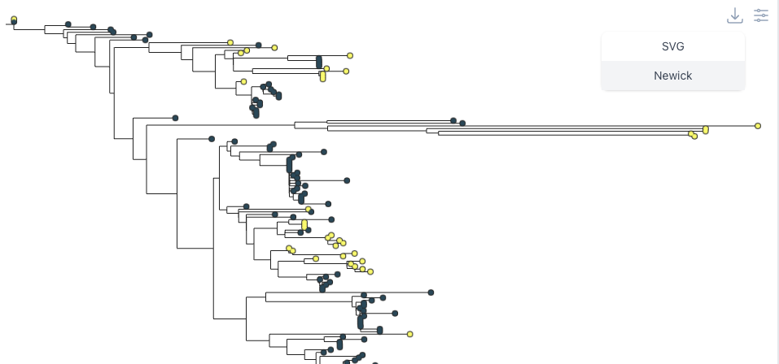
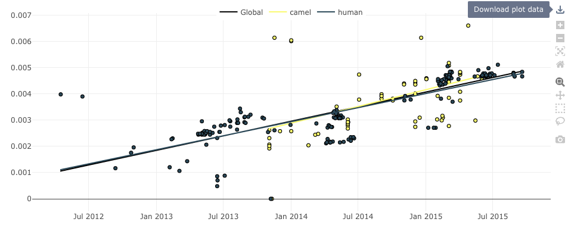

# Exporting data 

Clockor2 has several methods for exporting data and figures. 

## Exporting tree data

To export the `newick` file click the download icon on the tree panel and select newick. 

## Exporting regression data

To export the regression data click the `download plot data` icon on the regression panel. 

This will export the regression and point data as an array for JSON objects that can be used in downstream analyses (e.g. R or Python).

